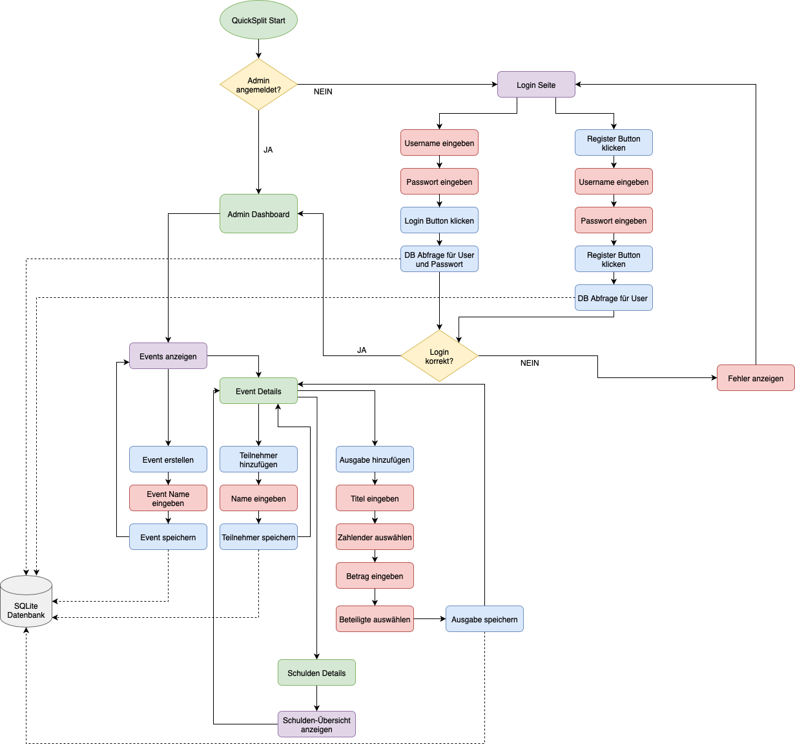

{: .label }
Arblir Meta, Mohamed Shiref

{: .no_toc }
# Architecture

{: .text-delta }

Table of contents

+ ToC
{: toc }

## Overview

QuickSplit ist eine Flask-basierte Webanwendung zur Verwaltung und fairen Aufteilung von Gruppenausgaben. Die Anwendung ermöglicht es Administratoren, Events zu erstellen und zu verwalten, während Benutzer innerhalb dieser Events Ausgaben erfassen und automatisch berechnen können, wer wem wie viel Geld schuldet.

Die Architektur folgt dem Model-View-Controller (MVC) Muster:

-Model: Die Daten werden in einer lokalen SQLite-Datenbank gespeichert.

-View: Jinja2-Templates mit Bootstrap 5 für das Frontend

-Controller: Flask-Routen für die Geschäftslogik und API-Endpunkte

Die Anwendung ist modular aufgebaut, mit klarer Trennung zwischen Datenbankzugriff, Geschäftslogik und Präsentationsschicht.

## Komponenten und Datenfluss

Unsere App besteht aus verschiedenen Komponenten, die zusammenarbeiten:

1. Datenbank: Speichert alle Informationen zu Events, Benutzern und Ausgaben
(Details zum Datenmodell finden sich auf der Datenmodell-Seite)

2. Backend-Logik: Verarbeitet Anfragen, berechnet Schulden und stellt Daten bereit

3. Frontend: Zeigt die Benutzeroberfläche an und ermöglicht Interaktionen

Der typische Datenfluss sieht so aus:

1. Benutzer klickt auf etwas oder füllt ein Formular aus

2. Die Anfrage geht an eine Route in Flask

3. Die Route verarbeitet die Anfrage und greift auf die Datenbank zu

4. Die Daten werden aufbereitet und an ein Template übergeben

5. Das Template wird gerendert und als HTML an den Benutzer zurückgeschickt

## Codemap

Hier ist ein Überblick über die wichtigsten Dateien und Ordner in unserem Projekt:

-app.py: Hauptanwendung, startet den Server

-database.py: Datenbankmodelle und Verbindung

**routes/:** Controller-Logik

-events.py: Event-Verwaltung + Schuldenberechnung

-users.py: Benutzer-Verwaltung

-expenses.py: Ausgaben-Verwaltung

-auth.py: Admin-Login

**templates/:** HTML-Templates

-base.html: Basis-Layout

-index.html: Startseite

-404.html: Fehlerseite

-auth/: Login-Seiten

-events/: Event-Seiten

-users/: Benutzer-Seiten

-expenses/: Ausgaben-Seiten

**static/:** CSS und andere statische Dateien

-style.css: Unsere CSS-Anpassungen

Die wichtigsten Teile sind:

-app.py: Hier startet alles. Diese Datei lädt alle anderen Teile und startet den Server.

-outes/: Hier ist die Hauptlogik der App. Jede Datei kümmert sich um einen bestimmten Bereich.

-templates/: Hier sind alle HTML-Seiten, die der Benutzer sieht.

## Cross-cutting concerns

[Describe anything that is important for a solid understanding of your codebase. Most likely, you want to explain the behavior of (parts of) your application. In this section, you may also link to important [design decisions](../design-decisions.md).]
