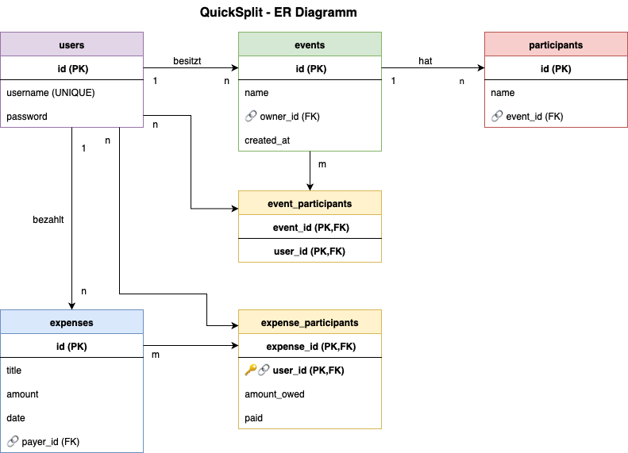

{: .label }
Arblir Meta

{: .no_toc }
# Data model

<details open markdown="block">
{: .text-delta }
<summary>Table of contents</summary>
+ ToC
{: toc }
</details>

# Übersicht

Für QuickSplit haben wir ein vollständiges Datenmodell entwickelt, das alle Features der finalen App abbildet. Die Struktur unterstützt Benutzer-Verwaltung, Events, lokale Teilnehmer und komplexe Ausgaben-Aufteilungen.

Da wir uns für SQLite entschieden haben (siehe [Design Decisions](../design-decisions.md)), war es wichtig, ein Schema zu entwerfen, das auch ohne komplexe Joins funktioniert.

# ER-Diagramm



# Tabellen im Detail

**Users**

Die Users-Tabelle speichert Informationen über registrierte Benutzer, die sich anmelden und Events erstellen können:

- `id` (INTEGER PRIMARY KEY AUTOINCREMENT) - Eindeutige ID (Primärschlüssel)
- `username` (TEXT UNIQUE NOT NULL) - Benutzername für den Login
- `password` (TEXT NOT NULL) - Passwort für die Authentifizierung

Ein User kann mehrere Events erstellen und an verschiedenen Events teilnehmen.

**Events**

Events sind die Hauptorganisationseinheiten in unserer App:

- `id` (INTEGER PRIMARY KEY AUTOINCREMENT) - Eindeutige ID (Primärschlüssel)
- `name` (TEXT NOT NULL) - Name des Events (z.B. "Urlaub in Italien")
- `owner_id` (INTEGER) - Fremdschlüssel zum User, der das Event erstellt hat
- `created_at` (TIMESTAMP DEFAULT CURRENT_TIMESTAMP) - Zeitpunkt der Erstellung

Ein Event kann mehrere Teilnehmer und Ausgaben haben.

**Event_Participants**

Diese Tabelle verbindet registrierte Users mit Events (viele-zu-viele Beziehung):

- `event_id` (INTEGER NOT NULL) - Teil des zusammengesetzten Primärschlüssels, Fremdschlüssel zum Event
- `user_id` (INTEGER NOT NULL) - Teil des zusammengesetzten Primärschlüssels, Fremdschlüssel zum User

PRIMARY KEY (event_id, user_id)

**Participants**

Participants sind lokale Teilnehmer eines Events (ohne eigenen Login):

- `id` (INTEGER PRIMARY KEY AUTOINCREMENT) - Eindeutige ID (Primärschlüssel)
- `name` (TEXT NOT NULL) - Name des Teilnehmers
- `event_id` (INTEGER NOT NULL) - Fremdschlüssel zum Event, zu dem der Teilnehmer gehört

Ein Participant gehört zu genau einem Event und kann Ausgaben bezahlen oder an Ausgaben beteiligt sein.

**Expenses**

Expenses sind die Ausgaben innerhalb eines Events:

- `id` (INTEGER PRIMARY KEY AUTOINCREMENT) - Eindeutige ID (Primärschlüssel)
- `title` (TEXT NOT NULL) - Titel der Ausgabe (z.B. "Hotelrechnung")
- `amount` (REAL NOT NULL) - Betrag in Euro
- `date` (DATE DEFAULT CURRENT_DATE) - Datum der Ausgabe
- `payer_id` (INTEGER NOT NULL) - Fremdschlüssel zum User, der bezahlt hat
- `event_id` (INTEGER NOT NULL) - Fremdschlüssel zum Event, zu dem die Ausgabe gehört

Eine Ausgabe gehört zu genau einem Event, hat genau einen Zahler und kann mehrere beteiligte Personen haben.

**Expense_Participants**

Diese Tabelle ist eine Verknüpfungstabelle, die die Viele-zu-viele-Beziehung zwischen Ausgaben und beteiligten Benutzern abbildet:

- `expense_id` (INTEGER NOT NULL) - Teil des zusammengesetzten Primärschlüssels, Fremdschlüssel zur Ausgabe
- `user_id` (INTEGER NOT NULL) - Teil des zusammengesetzten Primärschlüssels, Fremdschlüssel zum User
- `amount_owed` (REAL NOT NULL) - Betrag, den der User für diese Ausgabe schuldet
- `paid` (BOOLEAN DEFAULT 0) - Status, ob der Betrag bereits bezahlt wurde

PRIMARY KEY (expense_id, user_id)

# Beziehungen

- **User erstellt Events** (1:n) - Ein User kann mehrere Events erstellen
- **User nimmt an Events teil** (n:m) - Über Event_Participants Tabelle
- **Event hat Participants** (1:n) - Ein Event kann mehrere lokale Teilnehmer haben
- **User zahlt Expenses** (1:n) - Ein User kann mehrere Ausgaben bezahlen
- **Event enthält Expenses** (1:n) - Ein Event kann mehrere Ausgaben haben
- **Users beteiligt an Expenses** (n:m) - Über Expense_Participants Tabelle

# Wichtige Queries

**Alle Events eines Users:**
```sql
SELECT * FROM events WHERE owner_id = ? ORDER BY created_at DESC;
```

**Alle Ausgaben eines Events mit Zahler-Namen:**
```sql
SELECT e.*, u.username as payer_name 
FROM expenses e 
JOIN users u ON e.payer_id = u.id 
WHERE e.event_id = ?
ORDER BY e.date DESC;
```

**Alle Teilnehmer einer Ausgabe:**
```sql
SELECT u.username 
FROM users u 
JOIN expense_participants ep ON u.id = ep.user_id 
WHERE ep.expense_id = ?;
```

**Lokale Teilnehmer eines Events:**
```sql
SELECT * FROM participants WHERE event_id = ? ORDER BY name;
```

**Schulden-Berechnung mit Bezahl-Status:**
```sql
SELECT ep.user_id, ep.amount_owed, ep.paid 
FROM expense_participants ep 
WHERE ep.expense_id = ?;
```

# Design-Überlegungen

**Warum Users und Participants getrennt?**  
Users sind registrierte Benutzer mit Login-Berechtigung. Participants sind nur lokale Teilnehmer eines Events ohne eigenen Login.

**Warum owner_id statt admin_id?**  
"Owner" beschreibt besser die Rolle - derjenige, der das Event erstellt und verwaltet.

**Warum REAL für amount?**  
SQLite REAL entspricht Python float und reicht für Euro-Beträge aus. Einfacher als Cent-Umrechnung.

**Warum amount_owed in expense_participants?**  
Ermöglicht ungleiche Aufteilung von Ausgaben. Jeder Teilnehmer kann einen anderen Betrag schulden.

**Warum paid Boolean?**  
Tracking des Bezahl-Status für bessere Übersicht, wer seine Schulden bereits beglichen hat.

**Warum event_participants Tabelle?**  
Ermöglicht, dass registrierte Users an mehreren Events teilnehmen können, ohne dass sie diese selbst erstellt haben.


