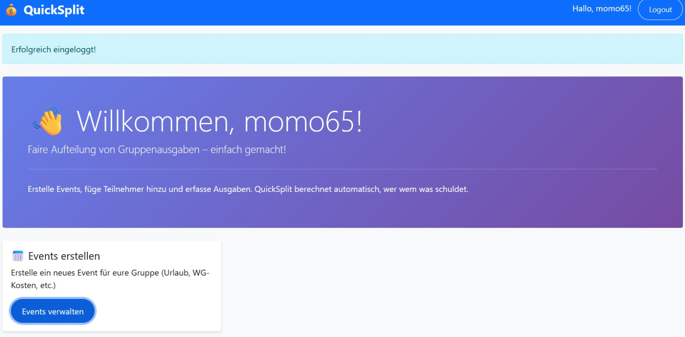
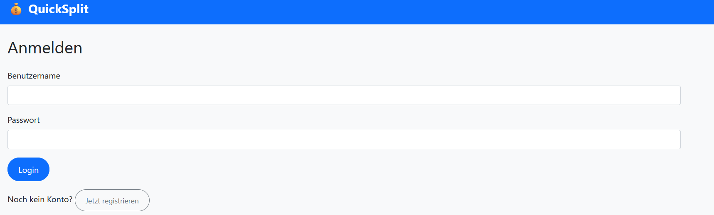
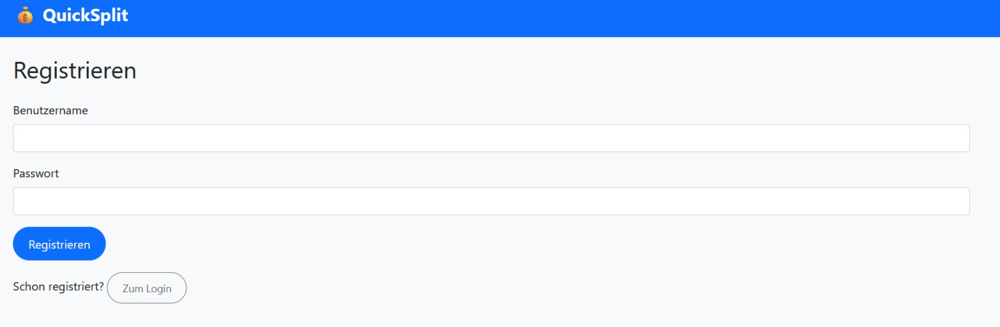
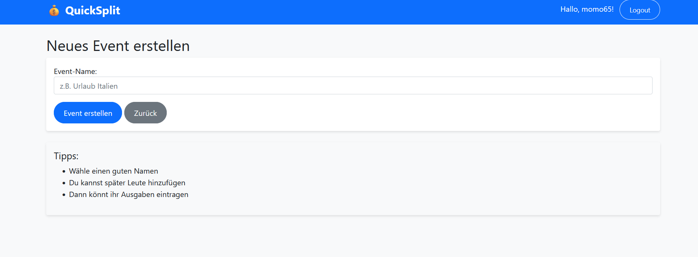
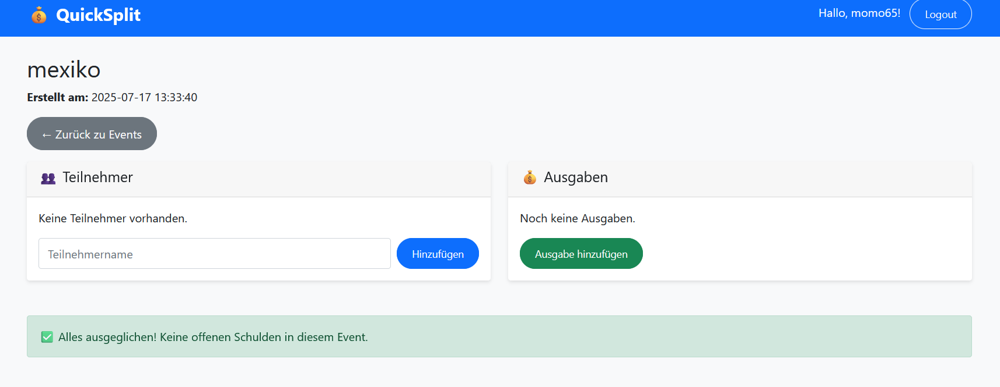
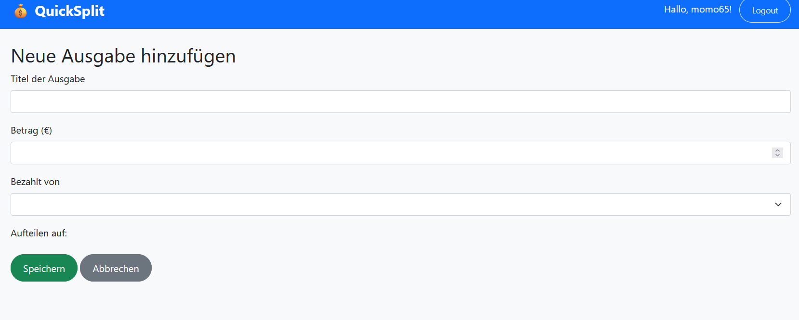
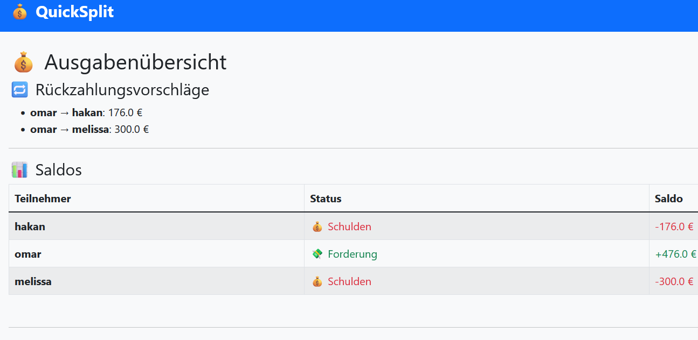
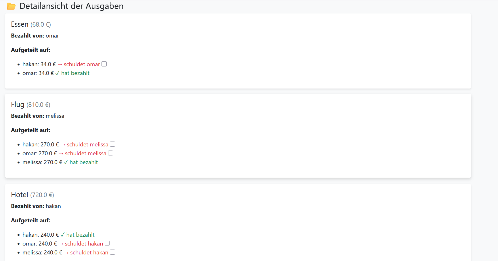

{: .label }
Arblir Meta & Mohamed Shiref

{: .no_toc }
# Reference documentation

{: .text-delta }

Table of contents

+ ToC
{: toc }

Diese Seite dokumentiert alle Routen und Funktionen der QuickSplit-Anwendung. Die Anwendung ist in mehrere Blueprints unterteilt für bessere Strukturierung.

## app.py (Hauptanwendung)

### `index()`

**Route:** `/`

**Methods:** `GET`

**Purpose:** Startseite der Anwendung. Zeigt das Dashboard mit Willkommensnachricht und Navigation zu den wichtigsten Features.

**Sample output:**

---

## auth.py (Authentifizierung)

### `login()`

**Route:** `/login`

**Methods:** `GET`, `POST`

**Purpose:** Benutzer-Login. Bei `GET` wird das Login-Formular angezeigt, bei `POST` wird die Authentifizierung durchgeführt.

**Sample output:**

### `register()`

**Route:** `/register`

**Methods:** `GET`, `POST`

**Purpose:** Benutzer-Registrierung. Erstellt neue Benutzerkonten mit gehashten Passwörtern.

**Sample output:**

---

## events.py (Event-Verwaltung)

### `create_event()`

**Route:** `/events/new`

**Methods:** `GET`,`POST`

**Purpose:** Erstellt ein neues Event. Bei `GET` wird das Formular angezeigt, bei `POST` werden die Eventdaten in die Datenbank geschrieben und der Benutzer weitergeleitet.

**Sample output:**

### `show_event(event_id)`

**Route:** `/events/<int:event_id>`

**Methods:** `GET`

**Purpose:** Zeigt alle Ausgaben eines bestimmten Events. Dient als zentrale Übersicht pro Event mit Option zur weiteren Bearbeitung.

**Sample output:**

### `add_expense(event_id)`

**Route:** `/events/<int:event_id>/add_expense`

**Methods:** `GET`,`POST`

**Purpose:** Zeigt das Formular zur Hinzufügung neuer Ausgaben (`GET`) oder fügt eine neue Ausgabe in die Datenbank ein (`POST`).

**Sample output:**

---

## expenses.py (Ausgaben-Verwaltung)

### `summary(event_id)`

**Route:** `/expenses/<int:event_id>/summary`

**Methods:** `GET`

**Purpose:** Diese Route berechnet, wie viel jeder Teilnehmer eines Events im Verhältnis zu den anderen bezahlt hat und erstellt eine kompakte Schuldenübersicht. Dabei wird so optimiert, dass möglichst wenige Transaktionen notwendig sind. Die Informationen werden als Übersicht aufbereitet und im Template `summary.html` angezeigt.

**Sample output:**

---

## Templates

Die Anwendung verwendet Jinja2-Templates mit Bootstrap für ein responsives Design. Flash Messages werden für User-Feedback verwendet.

## Datenbank

SQLite-Datenbank mit Row-Factory für dictionary-ähnlichen Zugriff. Siehe [Data Model](data-model.md) für Details.